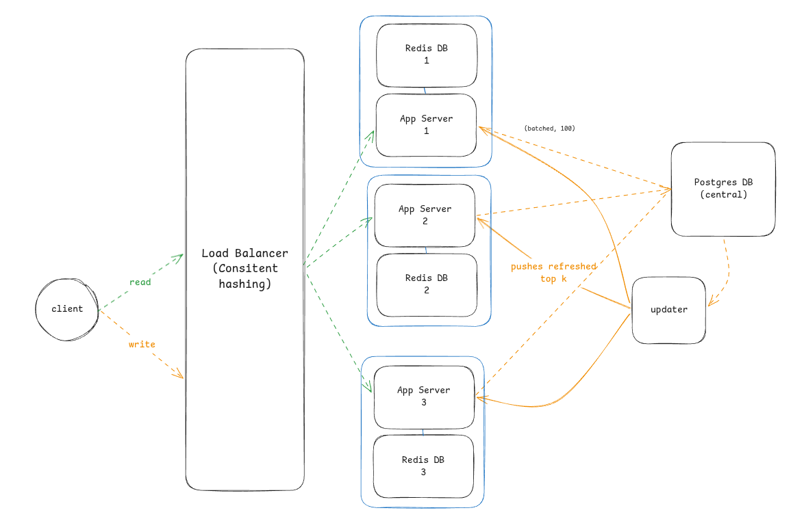

# Distributed Search Typeahead

A sharded autocomplete service. **Postgres is the durable source of truth** for
query counts; the **Redis shards are a derived per-prefix top-K cache** that a
consistent-hash load balancer reads from. A central **cache-updater** keeps the
shards in sync from Postgres, so a live search becomes visible in suggestions on
_any_ shard while each app node still talks only to its own Redis. Built entirely
on Bun (`Bun.serve`, `Bun.RedisClient`, `Bun.sql`) — no Express, no `ioredis`,
no `pg`.



_Reads (`/suggest`) and writes (`/search`) enter via the consistent-hash load
balancer. App nodes batch-write counts to central Postgres; the updater polls
Postgres and pushes refreshed top-K caches **through** the app nodes — each app
node is the sole writer of its own Redis._

## How it works

| Concern              | Where                                  | What                                                                                                                                                                                                                                         |
| -------------------- | -------------------------------------- | -------------------------------------------------------------------------------------------------------------------------------------------------------------------------------------------------------------------------------------------- |
| Consistent hashing   | `src/hash-ring.ts`                     | FNV-1a + 150 virtual nodes. `route(key)` maps any prefix/query → shard. Imported identically by seeder, LB, app nodes and updater.                                                                                                           |
| Source of truth      | `src/db.ts` + Postgres                 | `query_counts(query, count)` holds authoritative totals. `dirty_prefixes(prefix, dirty_at)` is the work queue for the cache.                                                                                                                 |
| Search               | `src/server.ts` `POST /search`         | Buffer the query in memory, return `202` immediately.                                                                                                                                                                                        |
| Batch writer         | `src/server.ts`                        | At `BATCH_SIZE` (100) — or after `FLUSH_INTERVAL_MS` — dedup counts, **UPSERT into Postgres + mark each prefix dirty** (one tx), and `ZINCRBY` the local trending ZSET.                                                                      |
| Cache updater        | `src/cache-updater.ts`                 | Polls `dirty_prefixes`, claims them with `DELETE … RETURNING`, recomputes each prefix's top-K from Postgres, groups by `route(prefix)`, and **POSTs each batch to that shard's app node** (`/internal/cache`). It holds no Redis connection. |
| Internal cache write | `src/server.ts` `POST /internal/cache` | App node applies the pushed top-K to **its own** Redis via an atomic Lua `DEL`+`ZADD`, rejecting any prefix it doesn't own. So each shard has exactly one writer. Not proxied by the LB.                                                     |
| Suggest              | `src/server.ts` `GET /suggest`         | `ZREVRANGE q:<prefix> 0 N-1` on the local shard → top-N. The cache it reads is maintained by the updater (via the app node).                                                                                                                 |
| Trending             | LB `GET /trending`                     | Each shard keeps a local `trending` ZSET; the LB fans out to all nodes and merges (each query lives on one shard).                                                                                                                           |
| Time decay           | `src/server.ts`                        | Every `DECAY_INTERVAL_MS` (24h) an atomic Lua script multiplies trending scores by `DECAY_FACTOR` (0.9).                                                                                                                                     |
| Load balancer        | `src/lb.ts`                            | Hashes `/suggest`/`/search` with the same ring, proxies to the owning node, logs each decision, serves the frontend.                                                                                                                         |
| Seeding              | `scripts/seed.ts`                      | Two phase: load `query_counts` from the dataset, then **derive** the shard caches from SQL top-K per prefix (same policy the updater uses live).                                                                                             |
| Frontend             | `public/`                              | Vanilla JS, 150ms debounced suggestions + a "Trending right now" board.                                                                                                                                                                      |

### Data model

- **Postgres** `query_counts(query PK, count BIGINT)` — durable totals;
  `dirty_prefixes(prefix PK, dirty_at)` — cache work queue.
- **Redis** `q:<prefix>` → **ZSET** of the top-`CACHE_K` queries for that prefix
  (derived); `trending` → **ZSET** per shard, decayed daily.

## How the write path stays consistent across shards

The earlier design wrote the suggestion cache directly from the app node, which
meant a live `/search` for query `q` only updated prefixes on `hash(q)`'s shard —
prefixes owned by other shards never saw it (the read for `/suggest?q=p` happens
on `hash(p)`'s shard). Strict 1:1 networking made cross-shard writes impossible.

The fix: **Postgres is the single source of truth, and the cache-updater computes
each prefix's top-K and pushes it — through the owning shard's app node — into
that shard's cache by `route(prefix)`.** App nodes write counts to Postgres + own
their Redis; the updater holds no Redis connection and reaches shards only via the
app nodes' `POST /internal/cache`. So **each Redis shard has exactly one writer
(its app node)** — the strictest form of the 1:1 rule — yet every live search is
globally visible, because the cache is updated on the exact shard `/suggest` reads.

Verified end-to-end: searching a query whose short prefix routes to a _different_
shard than the full query (e.g. `"plmk demo"`: query→shard 2, prefix `"plmk"`→shard 3)
appears in `/suggest?q=plmk` (served by shard 3) — and since the updater has no
Redis access at all, the cache could only have reached redis3 through app3.

## Run it

### Full cluster (Docker Compose)

```bash
docker compose up --build
# postgres + redis come up healthy; the `seed` job loads Postgres and derives the
# shard caches, then exits; app1/2/3, cache-updater and lb start.
# open http://localhost:8080
```

Strict networking (`docker-compose.yml`): each `appN` shares a redis network only
with its own `redisN`; app nodes + LB + the cache-updater meet on `mesh`; Postgres
lives on `pg`. The **cache-updater touches no Redis at all** — it reaches shards
only through the app nodes — so the only component on all three shard networks is
the one-shot `seed` job (which must write Redis directly because it runs before the
app nodes exist).

### Local dev (one Redis w/ 3 logical DBs + one Postgres)

```bash
docker run -d -p 6379:6379 redis:7-alpine                  # shards = DB 0/1/2
docker run -d -p 5432:5432 -e POSTGRES_USER=typeahead \
  -e POSTGRES_PASSWORD=typeahead -e POSTGRES_DB=typeahead postgres:16-alpine
bun run seed                                               # load PG + derive caches
bun run dev:app1 & bun run dev:app2 & bun run dev:app3 &   # ports 3001/2/3
bun run dev:updater &                                      # cache-updater
bun run dev:lb                                             # http://localhost:8080
```

### Tests

```bash
bun test        # consistent-hash determinism + balance
```

## Configuration (env)

| Var                                            | Default            | Purpose                                                |
| ---------------------------------------------- | ------------------ | ------------------------------------------------------ |
| `DATABASE_URL`                                 | local Postgres     | Central source of truth (Bun.sql)                      |
| `BATCH_SIZE`                                   | `100`              | Buffer size that triggers a batch write                |
| `FLUSH_INTERVAL_MS`                            | `5000`             | Safety-net flush for partial buffers                   |
| `MAX_PREFIX_LEN`                               | `32`               | Cap prefix generation (dataset has 500-char junk rows) |
| `CACHE_K`                                      | `50`               | Depth of each derived top-K cache (≥ `SUGGEST_LIMIT`)  |
| `CACHE_POLL_INTERVAL_MS` / `CACHE_DIRTY_BATCH` | `1000` / `200`     | Cache-updater cadence + batch size                     |
| `SUGGEST_LIMIT` / `TRENDING_LIMIT`             | `5` / `10`         | Result counts                                          |
| `DECAY_FACTOR` / `DECAY_INTERVAL_MS`           | `0.9` / `86400000` | Trending decay                                         |
| `SHARD_ID`, `PORT`, `REDIS_URL`                | per node           | App node identity                                      |
| `REDIS_URL_1/2/3`                              | localhost DBs      | Shard URLs (seeder + updater)                          |
| `APP_URL_1/2/3`, `LB_PORT`                     | localhost          | App node URLs (LB)                                     |
